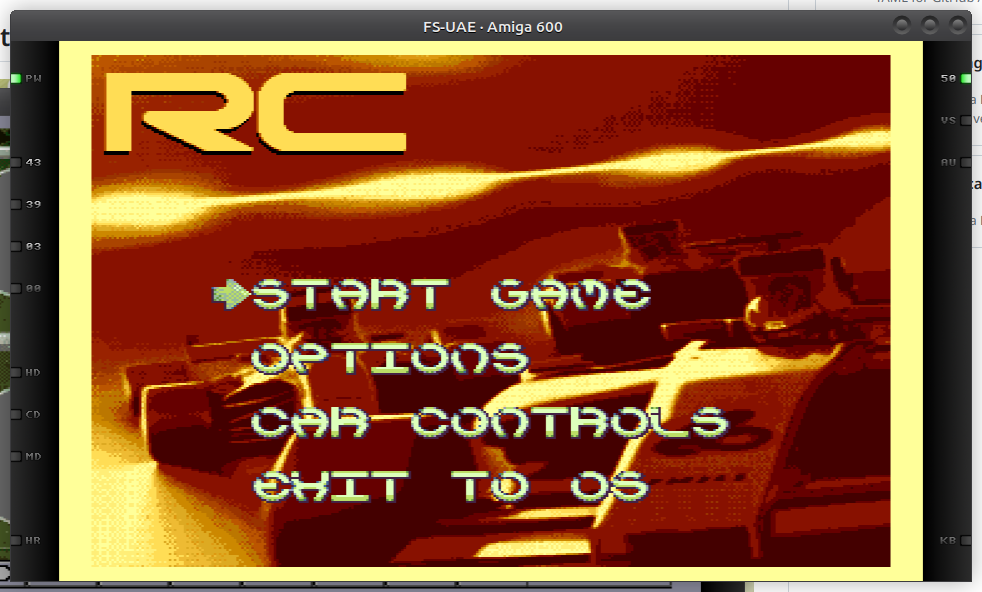
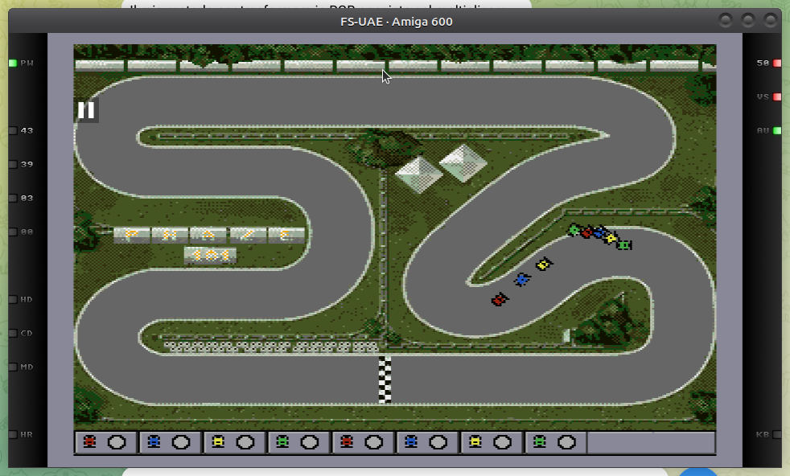

# RC (Rally Cross)

First of all the RC concept is not mine, I used to play an RC game in the late 90s on my Pentium
75Mhz machine (well... I remember the Amiga was already collecting dust in my attic at that
time). I don't remember where I found the game... I just remember it was a shareware game and my
friend bought the full version from the original author, Fabio Antoniazzi, then he sent back an envelope to him 
with 4 HD floppy disks inside. Well... for some strange reason I found this floppy disk on my
attic at the end of 2022 and they were still partially working.

In the same period, Phaze 101 launched a game jam on car racing games on Twitch, additionally, he
asked me to be a regular guest in his channel and talk about Amiga hardware programming. Since RC
was very fun to play I tried to do my own version for the Amiga and use the Twitch stream as a
developer diary. The final outcome is not really like the original RC cars but... I am quite happy
with the result considering the limitation of the Amiga if compared to a PC of late 90s.

## Screenshots

## Credits
Rc is a collective effort from the following people:
- Ozzyboshi / concept and code
- Vectrex28 / fonts
- Z3K / Tracks and background images
- Lunix / Tracks
- Oriens / Tracks
- Maze / mod.alfetta background music
- O. Stokka (4pLaY) / Coordination

## System requirements
RC cars should run on any classic Amiga with at least 1MB of chip ram, however, following there is
a list of configurations where I succesfully tested the game.
 * An Amiga 600 running Kickstart 2.04 with 2 mb of fast ram.
 * An Amiga 600 running Coffin OS 62 and a Vampire card V600.
 * An Amiga 500 plus running Kickstart 3.1 and a Aca 500 plus card.

The game can run from HARD DRIVE or, alternatively, from a self bootable DOS FLOPPY DISK.

## Installation
Installing RC could not be easier!

Simply copy all the contents from the floppy into a new folder on your hard drive. The tracks
folder must be at the same level of the rc executable. When the game is installed in your hard
drive you can get rid of the S folder which is needed only for booting from floppy drive.

## Todo
Obviously, RC is not complete. There is much room for expansion in RC. Features planned for the
future are:

    -[x]   add computer AI for self driven cars.
        optimizations.

    -[ ]   AGA and RTG version (maybe restoring the old 640X256 resolution with 256 colors!!!!!!)

    -[ ]   add paddle support

    If you have any reasonable suggestion, please email me 

## Starting RC
RC is OS friendly, running it should be quite trivial but anyway....

The easy way to run it is to use the self bootable disk provided on the github page. Just
insert the disk in your Amiga (or Gotek floppy emulator) and turn on the Amiga. The game should
also boot from external floppy drive readers (DF1: DF2 and DF3:).

If you installed the game on HD, then just double click on the rc icon, the game is OS friendly,
just ensure you have enough CHIP ram available when you run it (700kb should be more than enough).
In order to install the game on hard drive just drag and drop the floppy icon from your workbench into the destination drawer, there is no installation script so far.

Running the game from CLI is also possible, just go into the directory where you installed the game
and type "rc32" which is the name of the executable.

## How to Play
RC is a multiplayer game, it's meant to be played with friends, however, it is possible to put in play some
CPU driven cars.
Before starting the race I suggest to access the "Car setup screen" to set proper controls and CPU cars.
Supported Input modes for humans are the following:
* Joy on port 1
* Joy on port 0 (mouse port)
* Joy 2 and Joy 3 on parallel port (to use this you must have the hardware adapter)
* Keyboard arrows
* Keyboard WASD combination
* Keyboard IJKL combination
* Keyboard numpad (not Amiga 600)

Once car setup is complete you can proceed starting the championship.
For each race some points are awarded in this way:

* 10 points for the first place
*  8 points for the second place
*  7 points for the third place
*  6 points for the fourth place
*  5 points for the fifth place
*  4 points for the sixth place
*  3 points for the seventh place
*  1 points for the eigth place

Additionally, 3 extra points are awarded to the car able to perform the best lap.
Finally an extra point is awarded to the best leader (the player able to perform most laps as a leader of the race).

An circle shape indicator on the HUD screen, next to each car, will report the car currently holding the best lap (red inner circle)
and the best leader (blu circle).
The winner of the race is reported with a green circle.

To drive the car use the following controls:
- up: (or fire for joysticks) accelerate
- down: (or fire2 for joysticks) brake
- left: rotate the car counterclockwise
- right: rotate the car clockwise

During the race you can pause/unpause the game using the __spacebar__.
The race is considered completed only if all cars completed the expected number of laps.
Pressing __esc__ results in a race abort, no points are awarded and the race must be repeated in order to complete the championship.

## Physical release
There is no physical release of this game but if you really want you can just write the adf file provided in this github releases page into a floppy disk.
Additionally we provide this [box pdf](rc_ocs/docs/RCmini_Box_Cover-1.pdf), just print it and glue it on a box, we did that with a cereal box with excellent results.
The box will fit the floppy disk in any direction.
## Track files specification

For a full tutorial go to [this tutorial](rc_ocs/docs/trackcreationtutorial.md)

Tracks files must be stored inside tracks and tracksshr drawer, 
the first must contain the file in UNCOMPRESSED format, the second its shrinklerized version.
Files must have the .TRK extension, no other files must be stored in this drawer.
File name must be uppercase and letter + space character only.
The file must hold the following data:

* byte from 0 to 9599       -> raw planar image first bitplane (320X240)
* byte from 9600 to 19199   -> raw planar image second bitplane (320X240)
* byte from 19200 to 28799  -> raw planar image third bitplane (320X240)
* byte from 28800 to 38399  -> raw planar image fourth bitplane (320X240)
* byte from 38400 to 47999  -> raw planar image fifth bitplane (320X240)
* byte from 48000 to 48063  -> color palette (32 colors)
* byte from 48064 to 124863 -> track metadata (raw indexed image 1 byte each pixel)
* byte from 124864 to 124869 -> car 1 start position in this format: first word X position, second word Y position, third word degrees
* byte from 124870 to 124875 -> car 2 start position in this format: first word X position, second word Y position, third word degrees
* byte from 124876 to 124881 -> car 3 start position in this format: first word X position, second word Y position, third word degrees
* byte from 124882 to 124887 -> car 4 start position in this format: first word X position, second word Y position, third word degrees
* byte from 124888 to 124893 -> car 5 start position in this format: first word X position, second word Y position, third word degrees
* byte from 124894 to 124899 -> car 6 start position in this format: first word X position, second word Y position, third word degrees
* byte from 124900 to 124905 -> car 7 start position in this format: first word X position, second word Y position, third word degrees
* byte from 124906 to 124911 -> car 8 start position in this format: first word X position, second word Y position, third word degrees
* byte from 124912 to 125911 -> cpu points
* byte from 125912 to 125913 -> number of zones inside track
* byte from 125914 to 125915 -> CPU hotspot distance

### Raw planar image
    From byte 0 up to byte 47999 an image file is expected.
    Image size is expected to be 320X240 px and must be in planar format.
    Image must have 5 bitplanes, this means it can have up to 32 colors, however,
    since the Amiga shares the same palette with hardware sprites,
    you have to use some pre-defined values in order to do not change the colors of the cars.
    Here's the list of colors you should not change:

    * $DFF1A2 COLOR17   $0000
    * $DFF1A4 COLOR18	$0921

    * $DFF1AA COLOR21	$0000
    * $DFF1AC COLOR22	$025B

    * $DFF1B0 COLOR25	$0000
    * $DFF1B4 COLOR26	$0DD4

    * $DFF1BA COLOR29	$0000
    * $DFF1BC COLOR30	$04A4

    Color 17, 21, 25, 29 are used for the outline of the car, in order to stick out from the background,
    usually they are set to black or to a very dark color.

    Color 18,22,26 and 30 are used to paint the inner part of the car and they cannot be changed, this color
    are important to characterize/define/distingush the car team (red for Perrari or green for Alfa Marameo),
    in other words you should never change this values and the track image should use this colors as less as possibile
    in order to do avoid the track image to blend with the cars.

### Color palette
    Bytes from 48000 to 48063 are reserved to define the track color palette.
    Each color must be stored in 2 bytes and 24 bit format according to the Amiga hardware specifications, for example

    * to define a RED color store this binary data: $0F00
    * to define a GREEN color store this binary data: $00F0
    * to define a BLUE color store this binary data: $000F

    First nibble is ignored, by convention should be zero.
    Final size of palette data must be 64 bytes (2 bytes for each of the 32 colors).
    Again, when creating the palette keep in mind the suggestions described on the "Raw planar image" paragraph.

### Track metadata
    Byte from 48064 to 124863 is refered to track metadata.
    Track metadata is crucial to let the program calculate:
    * the type of terrain where each car is on (grass, asphalt, ice, ecc...)
    * if the location is walkable or there is an obstacle
    * the car zone
    * where the finish line is to count a lap

    A wrong track metadata could lead to the game be unplayable or glitchy, so pay attention when creating it.

    The "Track metadata" is another image that mirrors the previous image discussed on the "Raw planar image" paragraph.
    The "Track metadata" image is stored in chunky format, each byte represents one pixel on the screen.
    The first byte represent the first pixel starting from the upper left corner of the image, the second byte is the second pixel of the first row
    and so on.
    Each byte reports 2 information, the first nibble is reserved to describe a zone, the second one to describe the terrain.

    A byte equal zero (all 8 bits set to zero) means the pixel is "not walkable",
    in other words the car cant reach this location and it will bounce back,
    this is useful to describe track borders, walls and obstacles.

    Upper nibble of the byte is used to describe a zone number, zones are crucial to force the car to follow a very specific
    path, this ensures players to do not cheat and take shortcuts because each car is force to reach all the zone sequentially
    before reaching the finish line.
    Make sure to have a quite big last zone since all cars must be placed within this zone before the race starts.
    Usually the end of the last zone is marked with a finish line painted on the track, this is not mandatory but it's good
    to make the player realize when the lap (or the race) is over.

    Lower nibble of the byte is used to change car behaviour according to the terrain they are on, for example if the car is above
    a pixel describing a grass, the maximum allowed velocity is halved, if the car is on ice, the friction is decreased.

    Here is a list of nibbles recognized by the game:

    * 0000 : asphalt
    * 0001 : grass
    * 0010 : ice

    More terrain types could be implemented in the future for example 0011 mud or 0100 water.

### Cars start position
    From byte 124864 up to byte 124911 the game is expecting to find car positions.
    Since RC supports 8 cars, this area must be filled with 8 car start position.
    The format is X Y Z where:
    * X : X coordinate on the screen
    * Y : Y coordinate of the screen
    * Z : Angle in degrees of the car

    X and Y positions are relative to the upper left corner of the screen which takes coordinate 0,0 (origin of the axis).
    Z is an integer value between 0 and 359 and represent the orientation of the car before the race starts.
    Each value must be stored on unsigned 2 bytes format.

### Cpu point
    Byte from 124912 up to 125911 is reserved for cpu points.
    Cpu points are needed for CPU controlled cars: these points will form a path that must guide the CPU through the whole lap.
    The concept is very similar to "Hansel e Gretel" fable, the points are a reference for each car to do not get lost in the middle of the track.
    The cpu algotithm will try to find the best trajectory in order to get as closer as possible to each point, everytime a point is reached it will point to the next one.
    Cpu points are stored in X,Y format, each coordinate is stored in 2 unsigned bytes.
    Again, all coordinates are relative to point 0,0 which is the top left pixel on the screen.
    Last point must be mandatory with value $FFFFFFFF,this will signal to the RC game that we reached the end of the series of point (end of the lap)
    and the engine will reset next point to the first one in order to let the car perform another lap if the race is expecting more then one.
    Unused data left from the 1000 bytes reserved must be padded with $FFFFFFFF data.

### Number or zones
    Byte from 125912 to 125913 is an unsigned word number storing the number of zones used in the track, see section "Track metadata".
    The RC game will use this value in order to initialize the car and realize when the car completed a lap.

### License
RC is licensed under the GNU General Public License version 2
